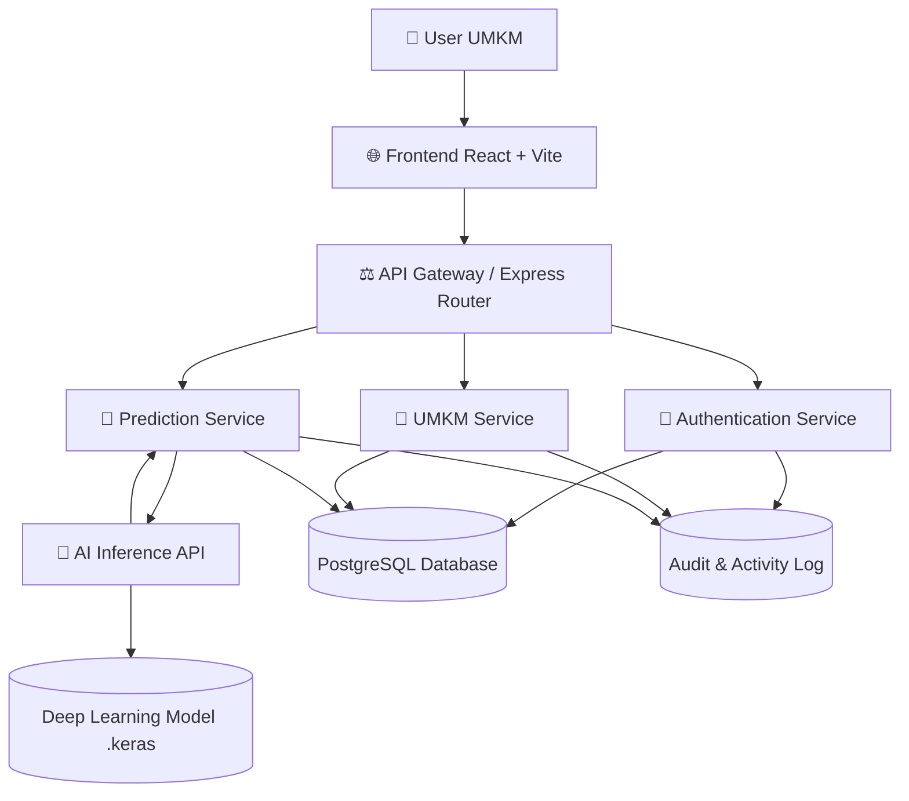
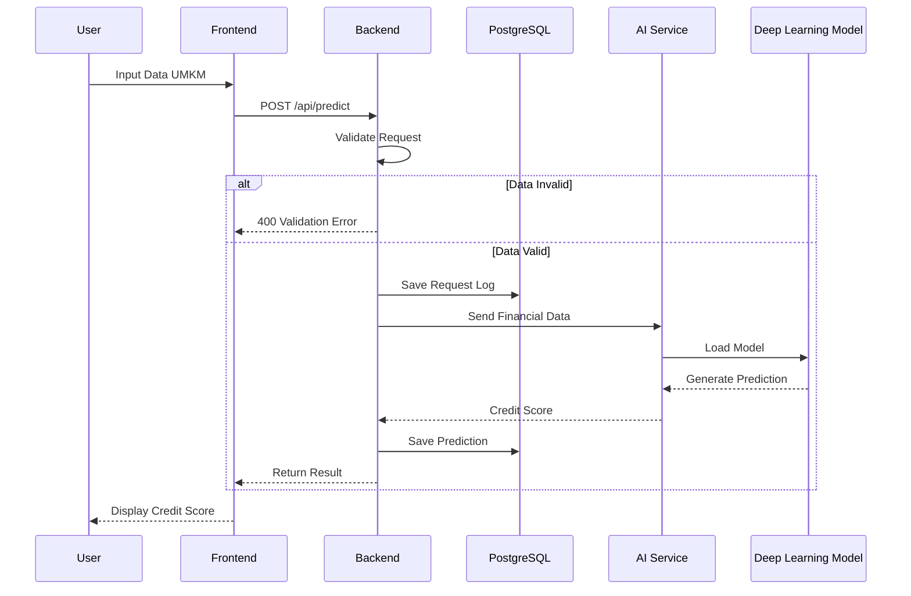
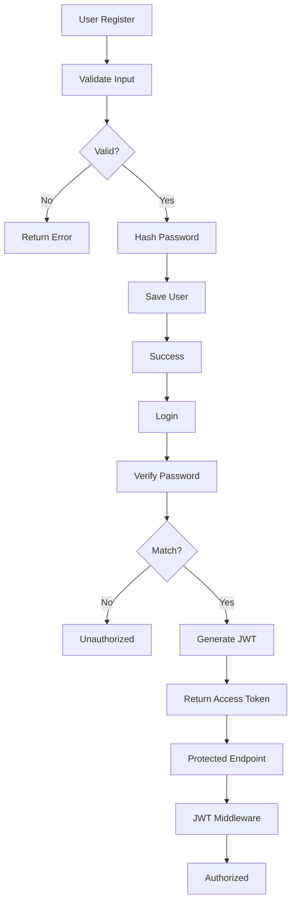
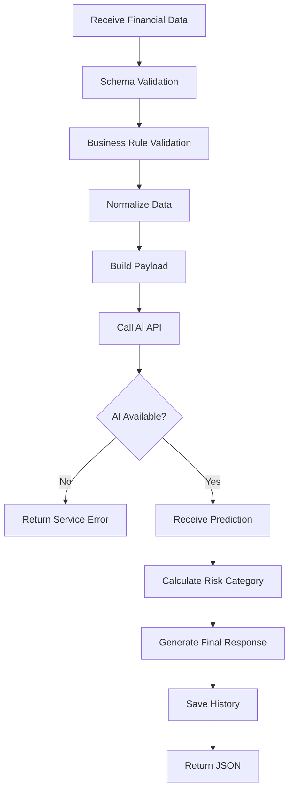
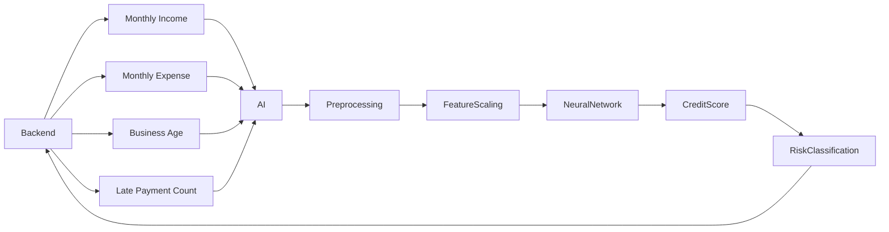
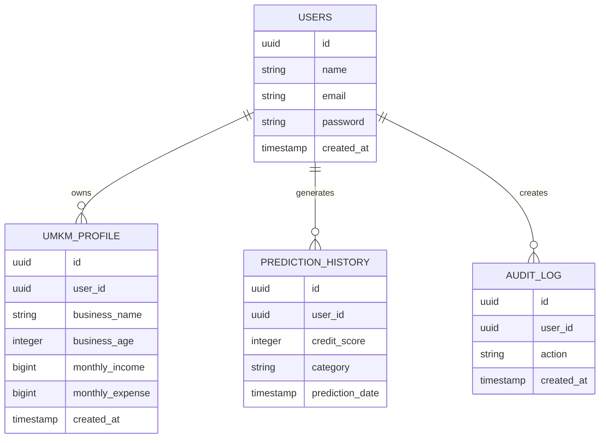
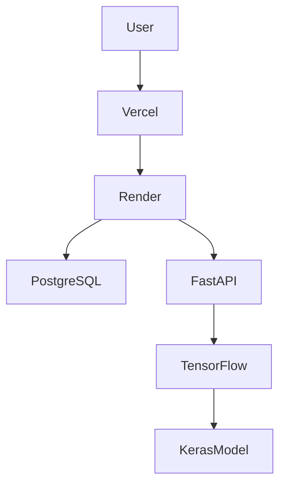

# 🚀 MicroCred AI Backend Architecture

## Sistem Penilaian Kelayakan Kredit UMKM Berbasis Deep Learning

Backend berfungsi sebagai pusat orkestrasi sistem yang menghubungkan Frontend, Database, Authentication Service, AI Inference Service, dan Monitoring Layer.

---

# 🏛 High Level Architecture



---

# 🧠 Backend Core Responsibilities

Backend bertanggung jawab untuk:

* Authentication & Authorization
* User Management
* UMKM Profile Management
* Financial Data Validation
* AI Prediction Orchestration
* Database Persistence
* Error Handling
* Audit Logging
* API Security
* Data Integrity

---

# 🔄 End To End System Flow



---

# 🔐 Authentication Flow



---

# 🧠 Credit Prediction Flow



---

# 📊 Deep Learning Integration Flow



---

# 🗄 Database Architecture



---

# 🌐 API Gateway Flow

```mermaid
flowchart TD

Client

--> Router

Router --> AuthMiddleware

AuthMiddleware --> ValidationMiddleware

ValidationMiddleware --> Controller

Controller --> Service

Service --> Repository

Repository --> PostgreSQL

Repository --> AI Service

Service --> Controller

Controller --> Response
```

---

# 📁 Backend Folder Structure

```text
backend
│
├── src
│
├── config
│   ├── database.js
│   ├── environment.js
│   └── jwt.js
│
├── controllers
│   ├── auth.controller.js
│   ├── user.controller.js
│   ├── umkm.controller.js
│   └── prediction.controller.js
│
├── services
│   ├── auth.service.js
│   ├── user.service.js
│   ├── umkm.service.js
│   ├── prediction.service.js
│   └── ai.service.js
│
├── repositories
│   ├── user.repository.js
│   ├── umkm.repository.js
│   └── prediction.repository.js
│
├── middlewares
│   ├── auth.middleware.js
│   ├── validation.middleware.js
│   ├── logger.middleware.js
│   └── error.middleware.js
│
├── routes
│   ├── auth.routes.js
│   ├── user.routes.js
│   ├── umkm.routes.js
│   └── prediction.routes.js
│
├── validators
│
├── utils
│
├── logs
│
├── prisma
│
├── tests
│
├── app.js
├── server.js
└── package.json
```

---

# ⚡ Deployment Architecture



---

# 🛡 Security Layer

## Authentication

* JWT Access Token
* Refresh Token

## Password Security

* bcrypt hashing
* Salt Rounds

## API Security

* Helmet
* CORS
* Rate Limiting

## Validation

* express-validator
* Request Sanitization

## Logging

* Winston Logger
* Audit Trail

---

# 📌 Main Endpoints

## Authentication

```http
POST /api/auth/register
POST /api/auth/login
GET  /api/auth/profile
```

## UMKM

```http
GET    /api/umkm
GET    /api/umkm/:id
POST   /api/umkm
PUT    /api/umkm/:id
DELETE /api/umkm/:id
```

## Prediction

```http
POST /api/predict
GET  /api/history
GET  /api/history/:id
```

---

# 🎯 Backend Milestone

### Sprint 1
* Architecture Design
* Database Design
* API Contract

### Sprint 2
* Express Setup
* PostgreSQL Setup
* Authentication

### Sprint 3
* CRUD UMKM
* Validation Layer

### Sprint 4
* AI Integration
* Prediction Service

### Sprint 5
* Security Hardening
* End-to-End Testing
* Deployment
* Documentation

---

# 📋 Jobdesk & Panduan Lengkap Backend Developer

Halaman ini mendefinisikan seluruh tugas, tanggung jawab (jobdesk), serta alur pengerjaan teknis pengembang Backend dalam proyek **MicroCred AI**.

---

## 🛠️ Stack Teknologi & Alat (Tools) yang Digunakan

Pengembang Backend bertanggung jawab penuh atas pengelolaan alat-alat berikut di setiap fase pengembangan:

### 1. Pengembangan Aplikasi & Framework
* **Runtime**: Node.js (sebagai runtime server backend).
* **Framework**: Express.js (v5.xx) - Digunakan untuk routing, middleware, dan penanganan HTTP request/response.
* **HTTP Client**: Axios - Berfungsi untuk memanggil dan bertukar payload dengan AI Inference Service yang berada di Hugging Face secara asinkron.

### 2. Autentikasi & Keamanan Data
* **bcrypt**: Melakukan *salting* dan *hashing* password user sebelum disimpan ke database (menjaga keamanan kredensial).
* **jsonwebtoken (JWT)**: Mengamankan resource/endpoint backend menggunakan token berbasis stateless JWT token-verification.

### 3. Database & Migrasi Skema
* **Database Engine**: PostgreSQL (Supabase cloud database).
* **Database Driver**: `pg` (Node-Postgres) - Penghubung native Node.js ke database PostgreSQL.
* **Migration Tool**: `node-pg-migrate` - Mengelola versi skema database (DDL) agar sinkron antar-developer secara deklaratif (menggunakan javascript script).
* **Connection Pooler**: Supabase Transaction Pooler (Port 6543) - Sangat krusial untuk mencegah kelebihan koneksi database (Max Connections) saat dideploy ke lingkungan serverless seperti Vercel.

### 4. Hosting & DevOps
* **Hosting Platform**: Vercel (Serverless Functions) - Hosting backend gratis dan berskala otomatis.
* **Deployment Config**: `vercel.json` - Mengatur perilaku build engine `@vercel/node`, routing rewrite, dan CORS headers.

---

## 📈 Alur Kerja & Fase Jobdesk Backend Developer

Berikut adalah detail tahapan kerja yang dilakukan oleh tim backend mulai dari tahap perencanaan hingga produksi:

### Fase 1: Perancangan Basis Data & Arsitektur
1. **Database Schema Design**: Merancang skema tabel relasional (users, profiles, predictions, logs) dan menyusun diagram ERD.
2. **API Contract Specification**: Menyusun format request body (JSON) dan standar JSON response agar frontend dan backend memiliki pemahaman struktur data yang sama.

### Fase 2: Inisialisasi Server & Setup Database
1. **Express Setup**: Konfigurasi server dasar, CORS (Cross-Origin Resource Sharing), parser JSON payload, dan setup error handler global.
2. **Database Migration Setup**: 
   * Menulis file migrasi database menggunakan `node-pg-migrate` untuk mendefinisikan tabel relasional.
   * Menjalankan perintah migrasi (`npm run migrate:up`) untuk membuat skema tabel secara otomatis di Supabase PostgreSQL.

### Fase 3: Pembuatan Sistem Otentikasi (Authentication Layer)
1. **User Registration**: Membuat endpoint `/auth/register` yang melakukan validasi keunikan email, validasi input data, hashing password menggunakan bcrypt, dan penyimpanan ke tabel `users`.
2. **User Login & Session**: Membuat endpoint `/auth/login` yang melakukan verifikasi password dan menerbitkan JWT Access Token.
3. **Route Protection Middleware**: Mengembangkan middleware `authMiddleware.js` untuk mengekstrak dan memverifikasi token JWT dari header `Authorization: Bearer <token>`, memblokir akses tidak sah ke endpoint privat.

### Fase 4: Integrasi AI & Logika Bisnis Prediksi
1. **Data Sanitization & Validation**: Memvalidasi data keuangan UMKM (pendapatan, pengeluaran bulanan, jumlah keterlambatan pembayaran) sebelum diproses.
2. **AI API Calling**: Mengembangkan prediction service yang memicu request POST menggunakan Axios ke API Inference (FastAPI) di Hugging Face Spaces yang menjalankan model Deep Learning `.keras`.
3. **Data Persistency**: Menyimpan riwayat masukan data dan status kelayakan kredit (Score, Kategori Risiko) yang dihasilkan AI ke tabel `prediction_history`.

### Fase 5: Pengamanan Sistem (Security Hardening) & Penanganan Error
1. **Global Error Middleware**: Mengembangkan penanganan error terpusat (`errorMiddleware.js`) agar aplikasi backend tidak crash jika terjadi kegagalan sistem, dan memberikan pesan kesalahan (error response) yang rapi.
2. **Response Standardization**: Menggunakan file utilitas response helper agar seluruh output API memiliki struktur seragam (`success`, `message`, `data`).

### Fase 6: Deployment & Ops
1. **Vercel Config**: Mengonfigurasi `vercel.json` untuk runtime `@vercel/node`.
2. **Production Env Variables**: Menyetel Environment Variables di Vercel Dashboard (`DATABASE_URL`, `JWT_SECRET`, dan `AI_INFERENCE_URL` menggunakan alamat Hugging Face yang asli).
3. **Database SSL & Pooler Configuration**: Mengarahkan URL database ke port 6543 (transaction pooling) untuk serverless environment dan memastikan driver `pg` berjalan dengan mode SSL aktif (`ssl: { rejectUnauthorized: false }`).

---

## 🎯 Detail Jobdesk Berdasarkan File di Codebase

Untuk memahami di mana pengembang backend harus bekerja, berikut adalah peta kontribusi file backend:

* **[app.js](file:///d:/Project-captone/Backend/app.js)**: Konfigurasi inisiasi Express server, middleware global, dan pendaftaran rute utama.
* **[config/database.js](file:///d:/Project-captone/Backend/config/database.js)**: Setup koneksi pooling database PostgreSQL dengan driver `pg` dan pengaturan SSL.
* **[middlewares/errorMiddleware.js](file:///d:/Project-captone/Backend/middlewares/errorMiddleware.js)**: Middleware global untuk intercepting error dan response format error standar.
* **[routes/authRoutes.js](file:///d:/Project-captone/Backend/routes/authRoutes.js)**: Peta rute pendaftaran & otentikasi user.
* **[routes/predictRoutes.js](file:///d:/Project-captone/Backend/routes/predictRoutes.js)**: Peta rute prediksi kelayakan kredit & riwayat prediksi.
* **[services/aiService.js](file:///d:/Project-captone/Backend/services/aiService.js)**: Layanan orkestrasi yang memanggil model AI TensorFlow di Hugging Face.

