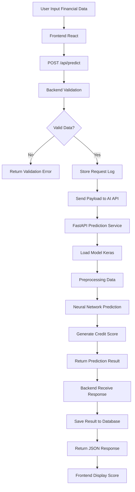
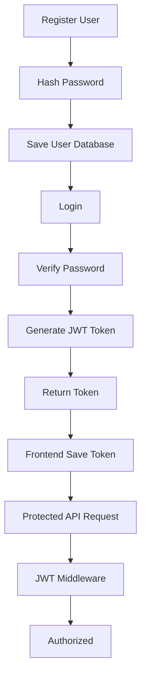
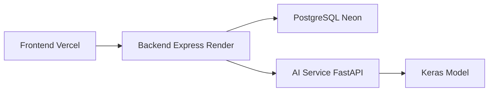

# Backend Architecture - MicroCred AI

## Sistem Penilaian Kelayakan Kredit UMKM Berbasis Deep Learning

Backend bertugas sebagai pusat komunikasi antara Frontend, Database PostgreSQL, dan AI Inference API. Seluruh data pengguna diproses melalui Backend sebelum diteruskan ke model Deep Learning.

---

# Backend Responsibilities

## 1. Authentication

Backend menangani:

* Registrasi pengguna
* Login pengguna
* Verifikasi JWT Token
* Proteksi endpoint

Endpoint:

```http
POST /api/auth/register
POST /api/auth/login
GET  /api/auth/profile
```

---

## 2. UMKM Management

Backend menyimpan data UMKM.

Endpoint:

```http
GET    /api/umkm
GET    /api/umkm/:id
POST   /api/umkm
PUT    /api/umkm/:id
DELETE /api/umkm/:id
```

---

## 3. Credit Prediction

Backend menerima data finansial dari Frontend kemudian mengirimkan data tersebut ke AI Service.

Endpoint:

```http
POST /api/predict
```

---

## 4. Prediction History

Backend menyimpan seluruh hasil prediksi.

Endpoint:

```http
GET /api/history
GET /api/history/:id
```

---

# Backend Technology Stack

| Component        | Technology        |
| ---------------- | ----------------- |
| Runtime          | Node.js           |
| Framework        | Express.js        |
| Database         | PostgreSQL        |
| ORM              | Prisma ORM        |
| Authentication   | JWT               |
| Password Hashing | bcrypt            |
| AI Communication | Axios             |
| Environment      | dotenv            |
| Validation       | express-validator |
| API Testing      | Postman           |

---

# High Level System Flow

```text
+-------------+
|   Frontend  |
| React + Vite|
+------+------+ 
       |
       |
       v
+-------------+
|   Backend   |
| Express API |
+------+------+ 
       |
       |
       +-------------------+
       |                   |
       v                   v
+-------------+   +----------------+
| PostgreSQL  |   | AI Inference   |
| Database    |   | FastAPI/Flask  |
+-------------+   +-------+--------+
                         |
                         |
                         v
                 +---------------+
                 | Deep Learning |
                 |   Model .keras|
                 +---------------+
```

---

# Detailed Prediction Flow



---

# Authentication Flow



---

# Database Schema

## users

```sql
CREATE TABLE users (
    id UUID PRIMARY KEY,
    name VARCHAR(100),
    email VARCHAR(100) UNIQUE,
    password TEXT,
    created_at TIMESTAMP
);
```

---

## umkm_profiles

```sql
CREATE TABLE umkm_profiles (
    id UUID PRIMARY KEY,
    user_id UUID,
    business_name VARCHAR(255),
    business_age INTEGER,
    monthly_income BIGINT,
    monthly_expense BIGINT,
    created_at TIMESTAMP
);
```

---

## prediction_history

```sql
CREATE TABLE prediction_history (
    id UUID PRIMARY KEY,
    user_id UUID,
    credit_score INTEGER,
    category VARCHAR(50),
    prediction_date TIMESTAMP
);
```

---

# API Contract

## Request

```json
{
  "monthly_income": 5000000,
  "monthly_expense": 2500000,
  "business_age": 3,
  "late_payment_count": 1
}
```

---

## Response

```json
{
  "success": true,
  "credit_score": 825,
  "category": "Layak",
  "risk_level": "Low Risk"
}
```

---

# Backend Folder Structure

```text
backend
│
├── src
│   ├── controllers
│   │   ├── auth.controller.js
│   │   ├── umkm.controller.js
│   │   └── prediction.controller.js
│   │
│   ├── routes
│   │   ├── auth.routes.js
│   │   ├── umkm.routes.js
│   │   └── prediction.routes.js
│   │
│   ├── services
│   │   ├── ai.service.js
│   │   └── auth.service.js
│   │
│   ├── middlewares
│   │   ├── auth.middleware.js
│   │   └── error.middleware.js
│   │
│   ├── models
│   │
│   ├── config
│   │   └── database.js
│   │
│   └── app.js
│
├── prisma
│
├── .env
├── package.json
├── server.js
│
└── README.md
```

---

# Security Layer

1. JWT Authentication
2. Password Hashing (bcrypt)
3. Request Validation
4. CORS Protection
5. Environment Variables
6. Error Handling Middleware
7. SQL Injection Prevention melalui ORM

---

# Deployment Architecture



---

# Milestone Backend

## Week 1

* Menentukan API Contract
* Mendesain Database
* Mendesain Arsitektur

## Week 2

* Setup Express.js
* Setup PostgreSQL
* Membuat REST API

## Week 3

* Implementasi Authentication
* CRUD UMKM

## Week 4

* Integrasi AI API
* Menyimpan Hasil Prediksi

## Week 5

* Testing
* Bug Fixing
* Deployment
* Dokumentasi

```
```
