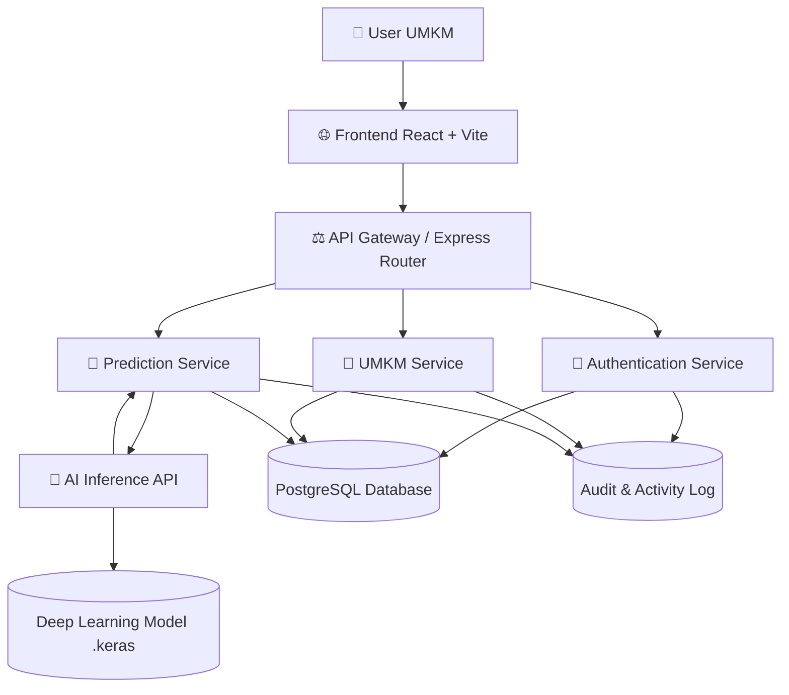
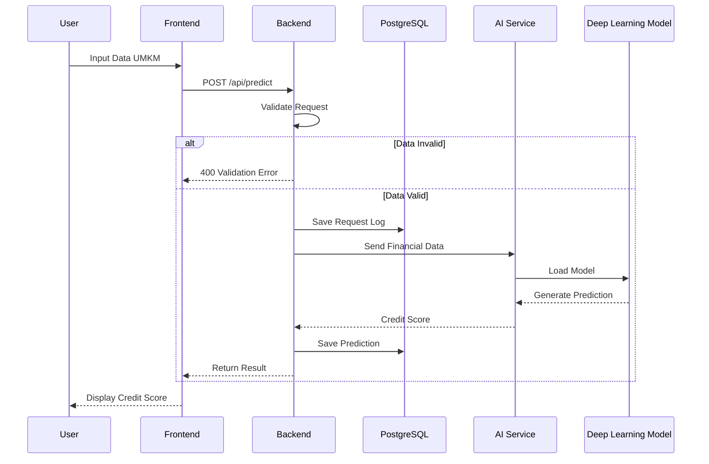
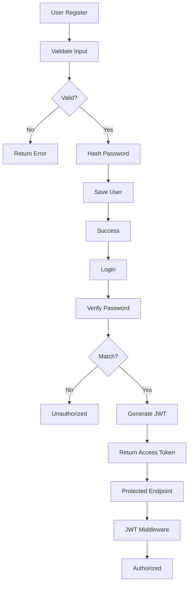
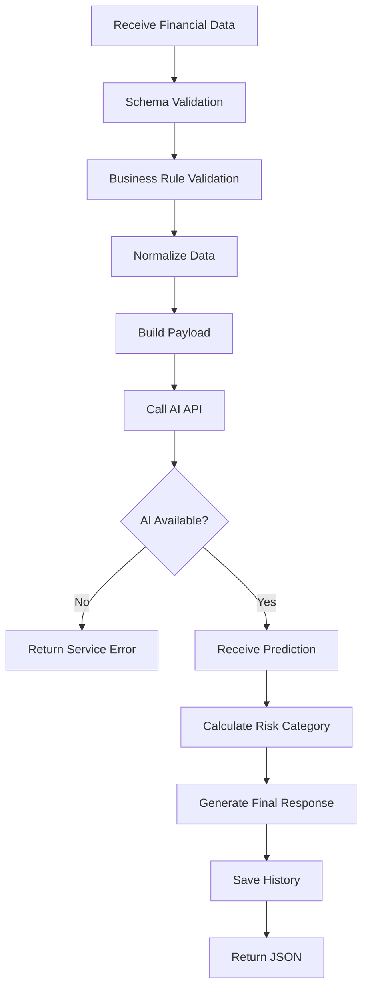
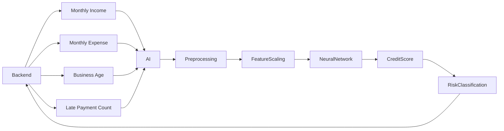
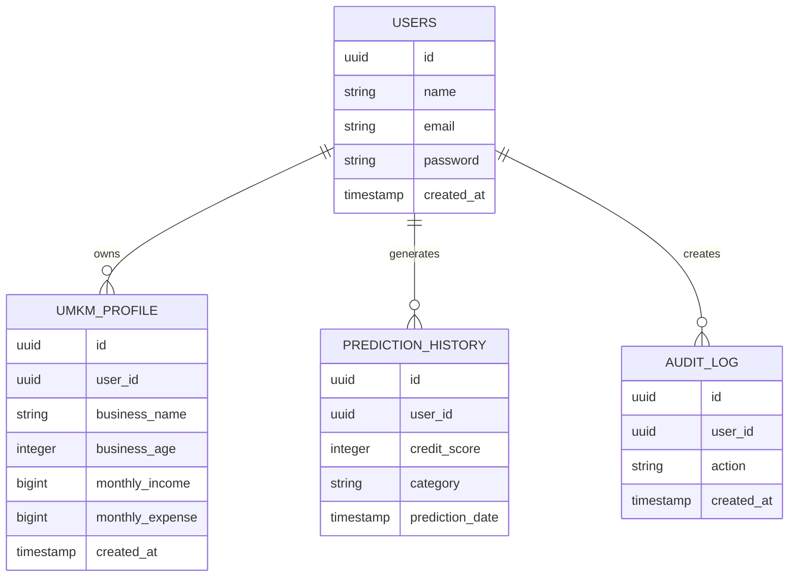
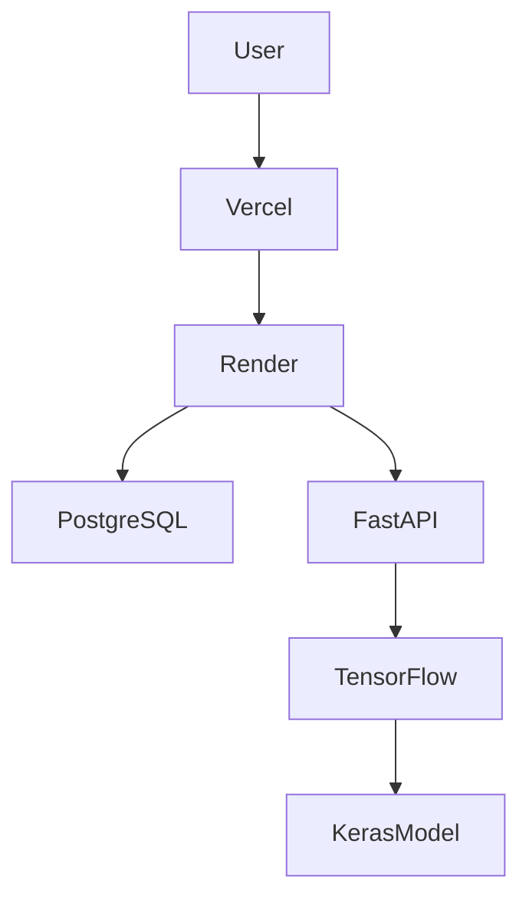

# 🚀 MicroCred AI Backend Architecture

## Sistem Penilaian Kelayakan Kredit UMKM Berbasis Deep Learning

Backend berfungsi sebagai pusat orkestrasi sistem yang menghubungkan Frontend, Database, Authentication Service, AI Inference Service, dan Monitoring Layer.

---

# 🏛 High Level Architecture



---

# 🧠 Backend Core Responsibilities

Backend bertanggung jawab untuk:

* Authentication & Authorization
* User Management
* UMKM Profile Management
* Financial Data Validation
* AI Prediction Orchestration
* Database Persistence
* Error Handling
* Audit Logging
* API Security
* Data Integrity

---

# 🔄 End To End System Flow



---

# 🔐 Authentication Flow



---

# 🧠 Credit Prediction Flow



---

# 📊 Deep Learning Integration Flow



---

# 🗄 Database Architecture



---

# 🌐 API Gateway Flow

```mermaid
flowchart TD

Client

--> Router

Router --> AuthMiddleware

AuthMiddleware --> ValidationMiddleware

ValidationMiddleware --> Controller

Controller --> Service

Service --> Repository

Repository --> PostgreSQL

Repository --> AI Service

Service --> Controller

Controller --> Response
```

---

# 📁 Backend Folder Structure

```text
backend
│
├── src
│
├── config
│   ├── database.js
│   ├── environment.js
│   └── jwt.js
│
├── controllers
│   ├── auth.controller.js
│   ├── user.controller.js
│   ├── umkm.controller.js
│   └── prediction.controller.js
│
├── services
│   ├── auth.service.js
│   ├── user.service.js
│   ├── umkm.service.js
│   ├── prediction.service.js
│   └── ai.service.js
│
├── repositories
│   ├── user.repository.js
│   ├── umkm.repository.js
│   └── prediction.repository.js
│
├── middlewares
│   ├── auth.middleware.js
│   ├── validation.middleware.js
│   ├── logger.middleware.js
│   └── error.middleware.js
│
├── routes
│   ├── auth.routes.js
│   ├── user.routes.js
│   ├── umkm.routes.js
│   └── prediction.routes.js
│
├── validators
│
├── utils
│
├── logs
│
├── prisma
│
├── tests
│
├── app.js
├── server.js
└── package.json
```

---

# ⚡ Deployment Architecture



---

# 🛡 Security Layer

## Authentication

* JWT Access Token
* Refresh Token

## Password Security

* bcrypt hashing
* Salt Rounds

## API Security

* Helmet
* CORS
* Rate Limiting

## Validation

* express-validator
* Request Sanitization

## Logging

* Winston Logger
* Audit Trail

---

# 📌 Main Endpoints

## Authentication

```http
POST /api/auth/register
POST /api/auth/login
GET  /api/auth/profile
```

## UMKM

```http
GET    /api/umkm
GET    /api/umkm/:id
POST   /api/umkm
PUT    /api/umkm/:id
DELETE /api/umkm/:id
```

## Prediction

```http
POST /api/predict
GET  /api/history
GET  /api/history/:id
```

---

# 🎯 Backend Milestone

### Sprint 1

* Architecture Design
* Database Design
* API Contract

### Sprint 2

* Express Setup
* PostgreSQL Setup
* Authentication

### Sprint 3

* CRUD UMKM
* Validation Layer

### Sprint 4

* AI Integration
* Prediction Service

### Sprint 5

* Security Hardening
* End-to-End Testing
* Deployment
* Documentation

```
```
